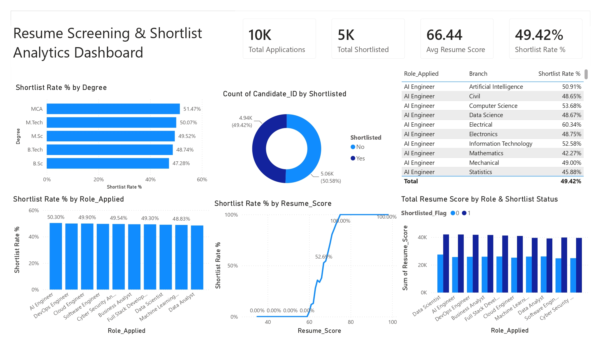

# 📄 Resume Screening & Shortlist Analytics Dashboard

A comprehensive **Power BI Dashboard** designed to analyze the resume screening and candidate shortlisting process. The dashboard provides insights into application volumes, resume scores, shortlist rates, degree-wise performance, role-based hiring trends, and recruitment efficiency to support data-driven talent acquisition decisions.

---

## 📷 Dashboard Preview

---

# 📌 Project Overview

The **Resume Screening & Shortlist Analytics Dashboard** enables recruiters and HR professionals to evaluate candidate applications, monitor shortlist rates, and analyze recruitment performance across different roles, educational qualifications, and resume scores.

The dashboard helps answer important recruitment questions such as:

- Which educational qualifications have the highest shortlist rates?
- Which job roles attract the most shortlisted candidates?
- How does resume score affect shortlisting?
- What is the overall recruitment success rate?
- Which branches perform best for specific job roles?

---

# 🎯 Business Problem

Recruitment teams receive thousands of applications for multiple job openings. Manually tracking resume quality, shortlist performance, and candidate success rates becomes difficult and time-consuming.

This dashboard centralizes recruitment analytics by providing:

- Resume screening insights
- Candidate shortlisting analysis
- Degree-wise performance comparison
- Resume score evaluation
- Role-based hiring trends
- Recruitment KPI monitoring

---

# 📂 Dataset

The dataset includes information such as:

- Candidate ID
- Resume Score
- Degree
- Branch
- Role Applied
- Shortlisted Status
- Shortlist Flag
- Application Details

---

# 📈 Dashboard KPIs

| KPI | Value |
|------|--------|
| Total Applications | 10K |
| Total Shortlisted | 5K |
| Average Resume Score | 66.44 |
| Shortlist Rate | 49.42% |

---

# 📊 Dashboard Features

## 1. Shortlist Rate by Degree

Compares shortlist percentages across educational qualifications, including:

- MCA
- M.Tech
- M.Sc
- B.Tech
- B.Sc

**Purpose**

- Evaluate which academic qualifications have the highest recruitment success.

---

## 2. Candidate Shortlisted Distribution

Donut chart displaying:

- Shortlisted Candidates
- Non-Shortlisted Candidates

**Purpose**

- Provide an overall view of recruitment outcomes.

---

## 3. Branch-wise Shortlist Summary

Interactive table showing:

- Role Applied
- Academic Branch
- Shortlist Rate

Examples include:

- Artificial Intelligence
- Computer Science
- Information Technology
- Data Science
- Electronics
- Mechanical
- Civil

**Purpose**

- Compare candidate performance across educational branches.

---

## 4. Shortlist Rate by Job Role

Analyzes shortlist percentages for roles such as:

- AI Engineer
- DevOps Engineer
- Cloud Engineer
- Software Engineer
- Cyber Security Analyst
- Business Analyst
- Full Stack Developer
- Data Scientist
- Machine Learning Engineer
- Data Analyst

**Purpose**

- Identify roles with the highest recruitment success rates.

---

## 5. Resume Score vs Shortlist Rate

Line chart illustrating the relationship between:

- Resume Score
- Shortlist Percentage

**Purpose**

- Understand how resume quality impacts candidate selection.

---

## 6. Resume Score by Role & Shortlist Status

Compares total resume scores for shortlisted and non-shortlisted candidates across different job roles.

**Purpose**

- Evaluate candidate quality and hiring outcomes by position.

---

# 🛠 Tools Used

- Microsoft Power BI
- Power Query
- DAX
- Microsoft Excel
- Data Modeling

---

# 📌 Key Insights

- Over **10,000** job applications were analyzed.
- Approximately **5,000** candidates were shortlisted, resulting in a **49.42%** shortlist rate.
- The average resume score is **66.44**.
- Candidates with resume scores above approximately **70** have significantly higher shortlisting chances.
- MCA and M.Tech graduates demonstrate the highest shortlist rates.
- AI Engineer and DevOps Engineer roles show consistently strong recruitment outcomes.
- Resume quality has a strong positive correlation with shortlisting success.

---

# 💼 Business Value

This dashboard helps organizations:

- Improve resume screening efficiency.
- Optimize hiring decisions using data.
- Identify high-performing candidate profiles.
- Evaluate recruitment performance by role and qualification.
- Reduce manual screening effort.
- Enhance talent acquisition strategies through actionable insights.

---

# 🚀 Future Enhancements

- AI-powered resume ranking
- Skill gap analysis
- ATS (Applicant Tracking System) integration
- Candidate experience tracking
- Interview performance analytics
- Predictive hiring recommendations using Machine Learning

---

# 📚 Skills Demonstrated

- Data Cleaning
- Data Modeling
- Power Query
- DAX Measures
- KPI Development
- HR Analytics
- Recruitment Analytics
- Dashboard Design
- Business Intelligence
- Data Visualization

---

# 👨‍💻 Author

**Yashwanth Katuru**

Aspiring Data Analyst | Power BI Developer

### Technical Skills

- Power BI
- SQL
- Excel
- Python
- HR Analytics
- Data Visualization
- Dashboard Development
